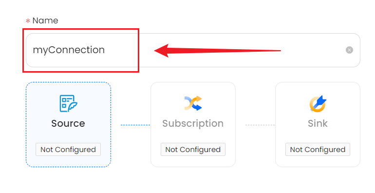

# CloudEvents

This guide contains information to set up a CloudEvents Source in Vanus Cloud.

## Introduction

Cloud events are a standardized way of describing event data in a platform-agnostic and vendor-neutral format. They provide a common format and metadata for describing events across different cloud providers, systems, and programming languages which are defined by the CloudEvents specification, which defines a set of common attributes such as event type, event source, and event ID, that describe the event data and a structured data format for events such as JSON for the event payload, which can be used to encapsulate different types of data. Cloud events are designed to be easy to consume and integrate with different cloud services and platforms, and to support event-driven architectures and serverless computing.

The CloudEvent Source is a Webhook server design to receive CloudEvents.

## Prerequisites

Before obtaining Payload URL to receive events, you must have:

- A [Vanus Cloud account](https://cloud.vanus.ai)

## Getting Started

To set up CloudEvents Source in Vanus Cloud, follow these steps:

1. Log in to your [Vanus Dashboard](https://cloud.vanus.ai/dashboard).
2. Click on the **create Connection** button under connections.
    

### Create your connection in Vanus Cloud

To set up CloudEvents in Vanus Cloud, follow these steps:

1. Write a name for your connection.

    

2. From the list of sources, choose **CloudEvents**.

    
    

3. Press **Next**, complete all other configurations.

    

## Supported Events

The CloudEvents source supports different kind of events structured in the CloudEvent specification

### Cloud Events Specification

```json
{
  "specversion": "1.0",
  "id": "ace872fa-21f8-40ce-8e99-fce6fd452a98",
  "source": "vanus-http-source",
  "type": "naive-http-request",
  "datacontenttype": "application/json",
  "time": "2023-03-28T07:49:08.892354632Z",
  "data": {
    "body": {
      "test": "Hello World"
    },
    "headers": {
      "Accept": "*/*",
      "Connection": "close",
      "Content-Length": "29",
      "Content-Type": "text/plain",
      "Host": "webhook.site",
      "User-Agent": "curl/7.78.0"
    },
    "method": "POST",
    "path": "/",
    "query_args": {}
  },
  "xvhttpremoteip": "172.17.0.1",
  "xvhttpremoteaddr": "172.17.0.1:57734",
  "xvhttpbodyisjson": "true"
}
```

The body of the request is extracted from `data.body` in the cloudevent and the headers are extracted from `data.headers` in the cloudevent.

Learn more about Vanus and Vanus Cloud in our [documentation](https://docs.vanus.ai).