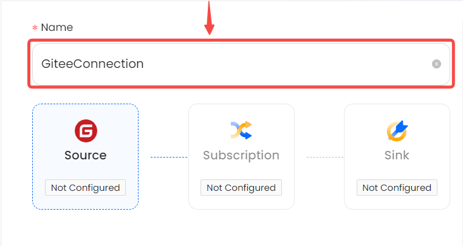
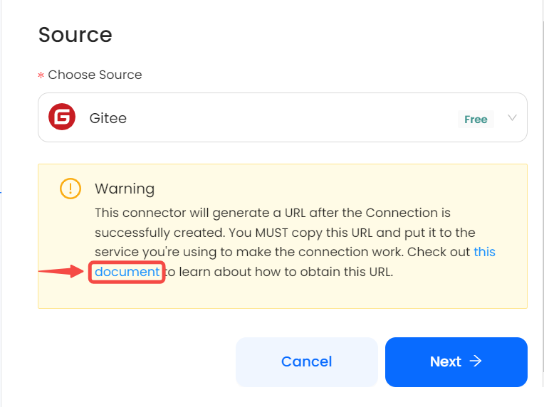

# Gitee

This guide contains information to set up a Gitee Source in Vanus Cloud.

## Introduction

Gitee is a web-based platform that provides version control and collaboration tools for software development projects. Gitee supports Git, a distributed version control system that allows developers to track changes to their code, collaborate with teammates, and manage different versions of their software projects. Users can create repositories to store their code and easily manage branches, commits, and pull requests.

The Gitee Source is a webhook server that enables you to establish an endpoint for receiving events from your Gitee application. To achieve this, it is necessary to establish a connection within Gitee.

## Prerequisites

Before obtaining Gitee events, you must have:

- An Gitee account with administrative privileges
- A [Vanus Cloud account](https://cloud.vanus.ai)

## Getting Started

### Create your connection in Vanus Cloud

1. Write a name for your connection.

    
2. After you finish creating the connection, there will be more steps. Please click the link to open a new tab with the following instruction.

    
3. Click **Next** and continue the configuration.

Learn more about Vanus and Vanus Cloud in our [documentation](https://docs.vanus.ai).
