**Configuring SAP BTP to Send Webhook Events** 

### Step 1: Configure webhook

1. Click the copy icon to copy the webhook url

2. Log in to your [SAP BTP account](https://accounts.sap.com/)

3. Navigate to the **Subaccount** page by clicking on it.
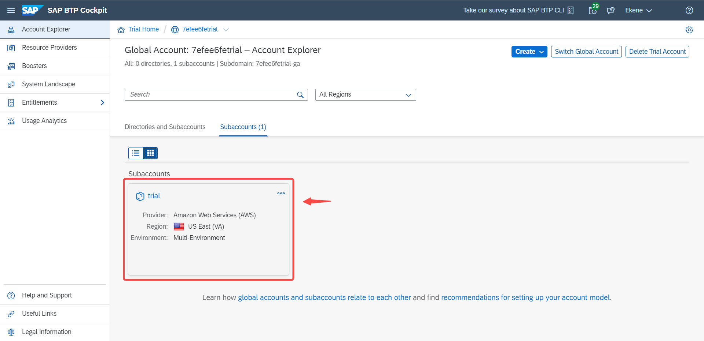

4. Click on **Instances and Subscriptions**.
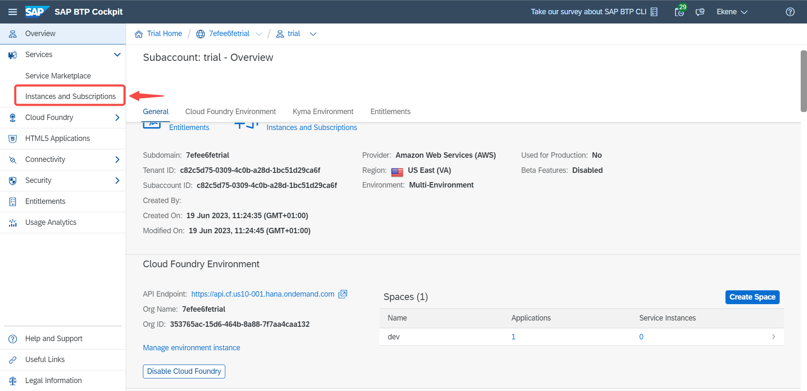

5. Click on the **Create** button at the top right.
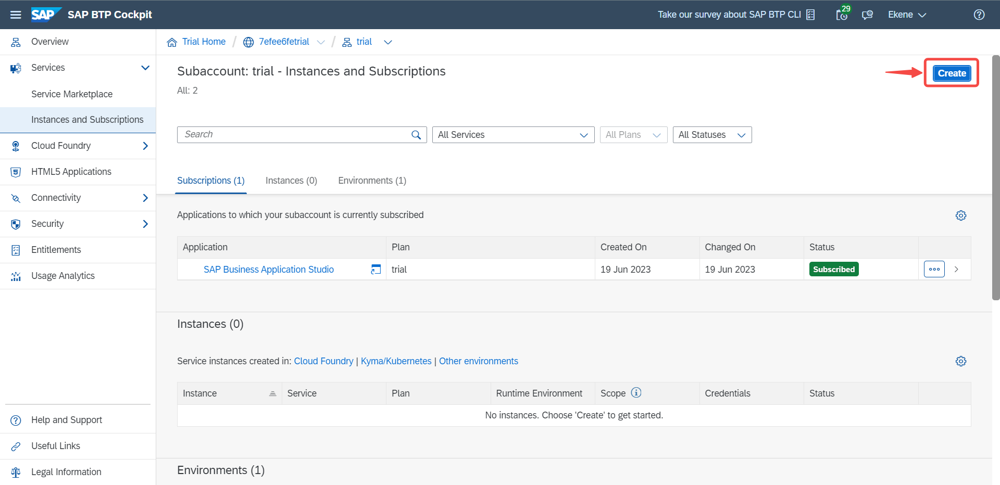

6. Under the **Service** section select the **Alert Notifications** and choose an **Instance Name** of your choice and click on **Next**.
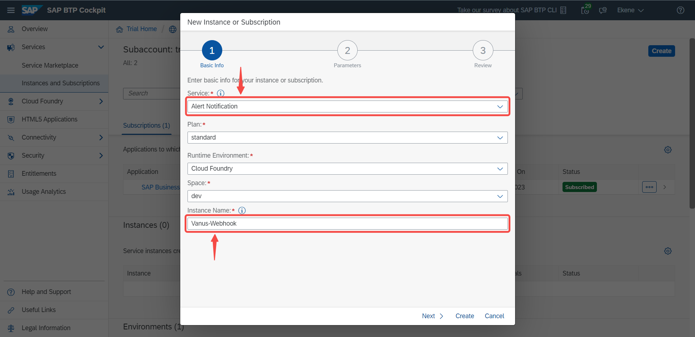

7. Leave the **Parameters** as default and click **Next**.
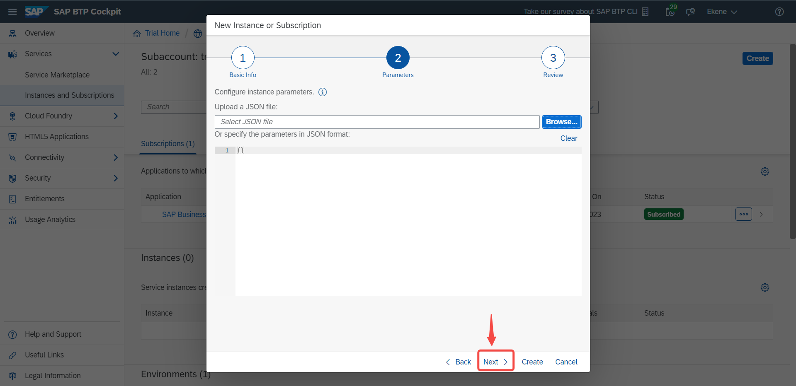

8. Click **Create**.
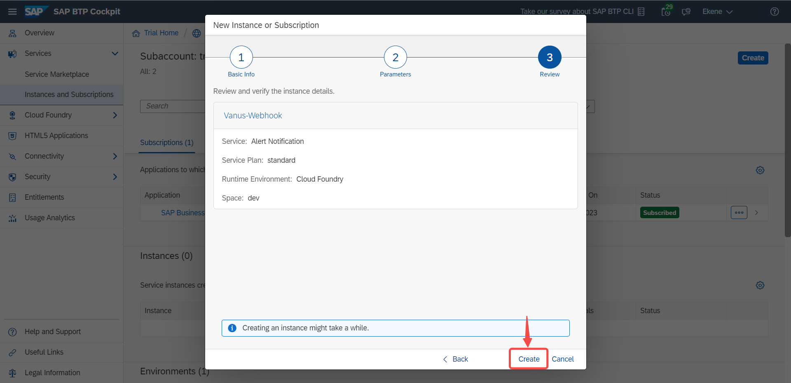

9. Click on the name of the **Instance** that was just created.
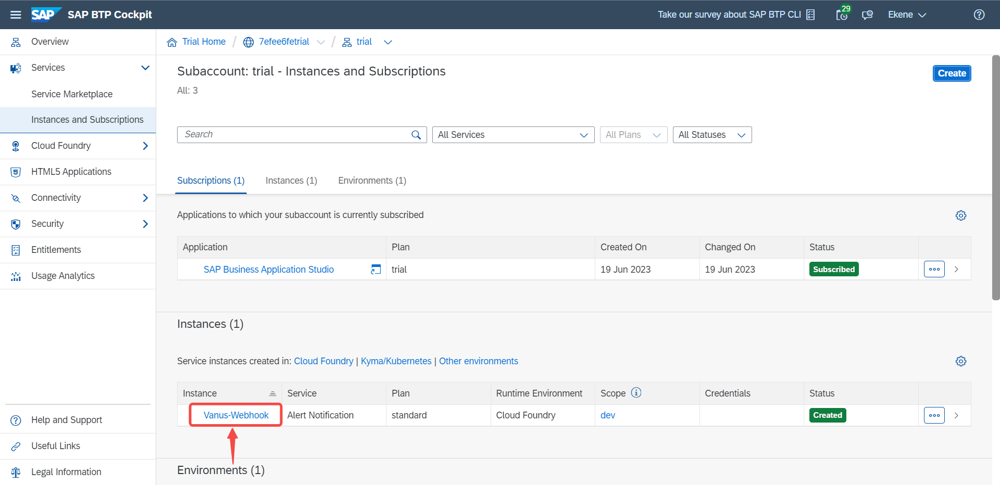

10. CLick on **Actions**.
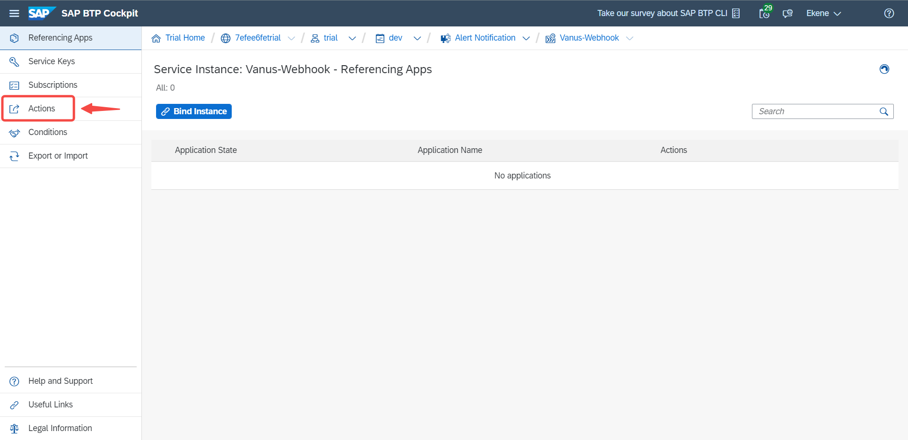

11. Click on **Create**.
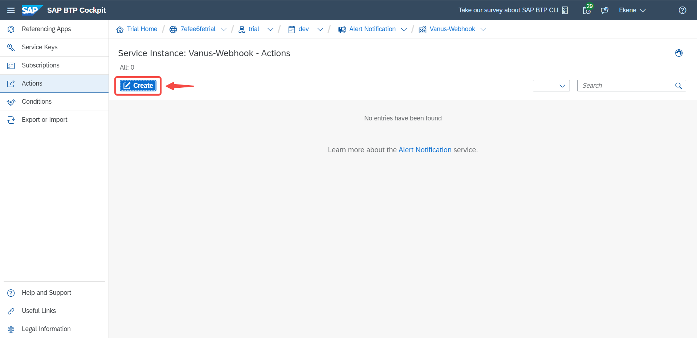

12. Scroll down and select **Webhook** as the action type and click on **Next**.

13. Insert a desired **Name** for your webhook and **Description** or **Labels** if any.
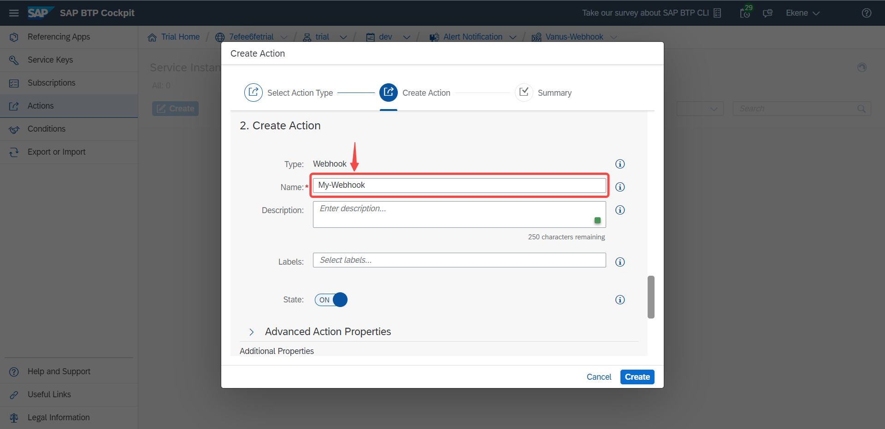

14. Scroll down, paste the webhook URL you copied earlier in the **URL Address** section and tick the **Accept any SSL certificate** checkbox.
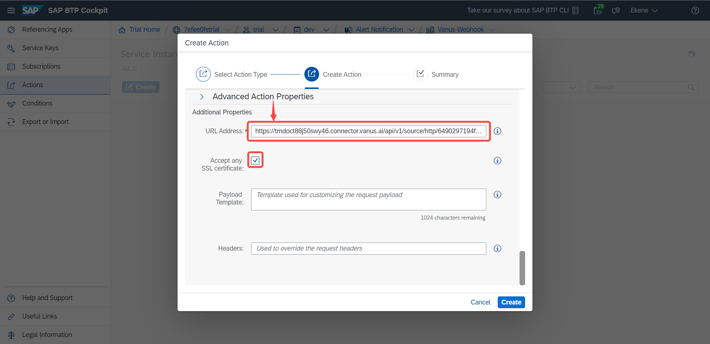

15. Click on **Close**.
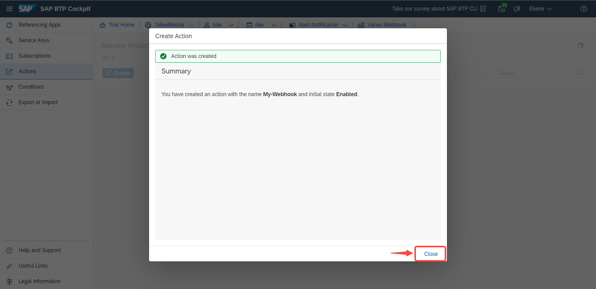

16. A successful webhook integration would look like this.
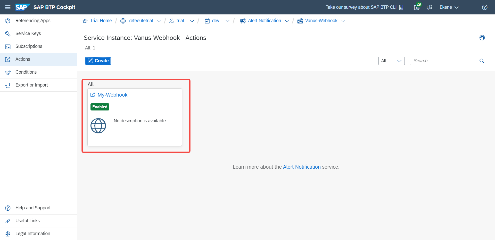

:::note
Do not select the **Webhook with Authorization Token** or **Webhook with Basic Authentication** as they would need extra level of authentication.
:::